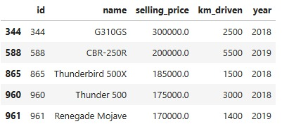

# Análise Exploratória do Mercado de Motocicletas

## Contexto do Problema
A Xtreme Groovy Bikes Sales é uma empresa de revenda de motocicletas. Seu modelo de nogócio é revender motocicletas usadas. Com a crescente do valor dos veículos usados, a XGB Sales, como é conhecida, deseja expandir os seus negócios. Você foi contratado como cientista de dados pela empresa XGB Sales para ajudá-los a encotrar as melhores motocicletas para revenda. 

Para isso, o CEO da empresa fez um estudo de mercado lhe entregou uma base de dados, obtida através desse estudo, para que você consiga auxiliá-lo a encontrar as melhores motocicletas para revenda, aumentando assim o lucro da empresa.

Além disso, o CEO lhe fez algumas perguntas a cerca da base de dados que a empresa possui.
Lembrando que o contexto, pessoas e perguntas são completamente fictícios e existem somente na minha imaginação.

## Desafio
A empresa XGB Sales lhe contratou como cientista de dados pois ela deseja aumentar o seu lucro comprando e revendendo as melhores motos disponíveis dentro da base de dados que a empresa adquiriu através de um estudo de mercado. Para isso, o CEO fez 3 rodadas de perguntas. Dessa forma, o objetivo principal é selecionar motos com no máximo 3 anos de uso, no máximo 40 mil quilometros rodados, que sejam de um único dono, que estejam sendo vendidas por possoas físicas e que tenham o valor pretendido de venda menor que o valor do showroom. 

## Base de dados
O conjunto de dados que representam o contexto está disponível na plataforma do Kaggle. O link para acesso aos dados: [Motorcycle Dataset](https://www.kaggle.com/datasets/nehalbirla/motorcycle-dataset)

Além disso, eles podem ser encontrados dentro do diretóirio `data` deste projeto.

## Resultados e Conclusões
### Resultado Geral do dataset
* Foram analisadas 1061 motos
* A moto mais antiga é de 1988 e a mais novo de 2020
* O valor da moto mais cara da base de dados é U$ 760000.00
* A moto que possui a maior quilometragem andou 880000 Km e a menor andou 350 Km
* O maior valor da moto sem as taxas de registro e seguro é de U$ 1278000.00 e a menor é de U$ 30490.00
* Entre as motos, temos 6 motos sendo vendidas por revendedores e temos 1055 motos sendo vendidas por seus donos
* O valor média do preço de venda das motos é de U$ 59638.15
* A média do ano das motos é 2014
* A média de quilometros percorridos é de 34359.83 Km
  
### Resultados em relação a quantidade de donos
* A base de dados possui 924 motos de um único dono
* As motos que possuem mais quilometragem percorrida, são as mais baratas
* As motos mais caras são as motos que tiveram 4 donos.
* Na média as motos que possuíram mais donos são as motos com maior quilometragem percorrida
* As motos que possuiram mais donos são sim as motos com maior idade média dentro da base de dados
* As motos que são revendidas pelos seus donos são as mais caras na média

### Resultados em relação ao fabricante 
* A fabricante que mais possui motos cadastradas e a mais antiga é a Bajaj
* Em média, o valor médio das motos da Harley-Davidson são as maiores.
* Activia possui a moto com a maior distância percorrida na base de dados
* Por fim, a fabricante que possui a moto mais cara na base de dados não é a fabricante que possui a menor quantidade de motos.

Podemos concluir que o valor de revenda está ligado positivamente ao número de donos. Fatores como quilometragem e maior idade pode impactar de forma negativa o valor das motos, e as principais fabricantes são: Bajaj, Harley-Davidson e Activia.

Entretanto, o CEO pediu uma seleção de motos com no máximo 3 anos de uso, no máximo 40 mil quilometros rodados, que sejam de um único dono, que estejam sendo vendidas por possoas físicas e que tenham o valor pretendido de venda menor que o valor do showroom. Para responder essa solicitação, temos a tabela abaixo:

## Próximos Passos
* Criação de um dashboard interativo para o CEO 

---
Este repositório foi criado durante as aulas de Git da Comunidade DS. Qualquer dúvida ou sugestão será muito bem vinda!

